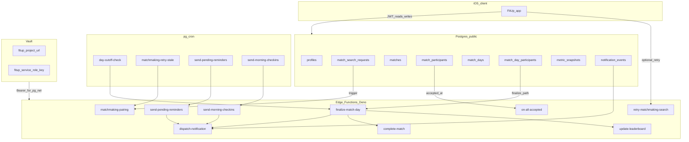
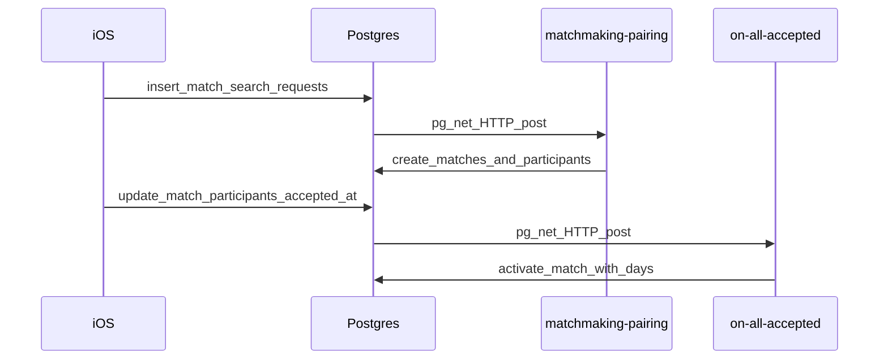

# FitUp — Supabase Setup Guide

*Complete backend setup for the FitUp iOS app. Two paths: **manual (Dashboard)** and **CLI + migrations (recommended)**.*

**Last updated:** April 2026 (restructured: migrations as source of truth)

---

## How to use this document

1. Read **Part 1 — Architecture overview** first (tables, functions, cron, how pieces connect).
2. Choose **Part 2 (Path A — manual)** or **Part 3 (Path B — CLI/migrations)** to stand up a project end-to-end.
3. Use **Part 4** for troubleshooting and operational notes.

**Related docs**

- [fitup-docs-pack.md](fitup-docs-pack.md) — Sections **15** (backend contract) and **16** (Supabase local / backup workflow); product and RLS expectations.
- [fitup-build-slices.md](fitup-build-slices.md) — **Slice 16** (Supabase migrations + deploy checklist).

**Rule of thumb:** If anything in this guide disagrees with **`supabase/migrations/*.sql`**, the **migrations win**. Refresh this guide when you add new migration files.

---

## Part 1 — Architecture overview (read first)

### 1.1 Extensions and schemas

From [`supabase/migrations/20260416114943_remote_schema.sql`](../../supabase/migrations/20260416114943_remote_schema.sql):

| Item | Purpose |
|------|---------|
| Extension **`pg_cron`** | Schedules recurring SQL (cron jobs). |
| Extension **`pg_net`** | Lets Postgres call HTTP (used to invoke Edge Functions from triggers/cron). |
| Schema **`private`** | Holds `invoke_*` helpers and other internal SQL. |
| **Supabase Vault** | Stores secrets `fitup_project_url` and `fitup_service_role_key` read by `private.invoke_edge_function` (see §1.4). |

### 1.2 Public tables (14)

| Table | Purpose | Key relationships |
|-------|---------|-------------------|
| `profiles` | App user profile row (linked to `auth.users` via `auth_user_id`). | PK `id`; optional `apns_token`, `live_activity_push_token`, `notifications_enabled`. |
| `user_health_baselines` | Rolling 7d steps/cals for matchmaking fairness. | PK `user_id` → `profiles(id)`. |
| `match_search_requests` | Public matchmaking queue. | `creator_id` → `profiles`; optional `matched_match_id` → `matches`. |
| `matches` | Competition container (type, metric, duration, state, times). | Participants, days, snapshots reference this. |
| `match_participants` | Who is in a match; acceptance timestamps. | `match_id`, `user_id` → `profiles`. |
| `direct_challenges` | Direct challenge invite state. | `challenger_id`, `recipient_id`; optional `match_id`. |
| `match_days` | One calendar day within a match. | `match_id` → `matches`; `winner_user_id` → `profiles`. |
| `match_day_participants` | Live + finalized totals per user per day. | `match_day_id`, `user_id`; drives finalization triggers. |
| `metric_snapshots` | Append-only HealthKit sync audit. | `match_id`, `user_id`, `source_date`. |
| `leaderboard_entries` | Weekly points / rank cache. | `user_id` → `profiles`. |
| `all_time_bests` | Personal bests. | `user_id` → `profiles`. |
| `notification_events` | Outbound notification audit (`pending` / `sent` / `failed`). | `user_id` → `profiles`. |
| `app_logs` | Optional client/dev logs. | `user_id` nullable → `profiles`. |

All of the above have **RLS enabled** in the migration; policies are defined in the same file.

### 1.3 Edge Functions (9)

Each function lives under [`supabase/functions/<name>/`](../../supabase/functions/).

| Function | Invoked by | Role |
|----------|------------|------|
| `matchmaking-pairing` | `private.invoke_matchmaking_pairing` (typically after `match_search_requests` insert via trigger chain) | Pairs compatible searches; creates `matches` + `match_participants`; notifies. |
| `retry-matchmaking-search` | iOS client (`MatchRepository`) with user JWT | Same pairing logic; retry if `pg_net` delivery failed. |
| `on-all-accepted` | `private.invoke_on_all_accepted` when participants finish accepting | Sets match active, creates match days, activation notifications. |
| `finalize-match-day` | Trigger path / `private.invoke_finalize_match_day` / cron-driven flows | Locks day scores, void/winner, leaderboard hook, notifications, may call `complete-match`. |
| `complete-match` | `finalize-match-day` when all days done | Sets `matches.state = completed`, completion notifications. |
| `update-leaderboard` | `finalize-match-day` | Weekly points / wins / losses / streak updates. |
| `dispatch-notification` | `private.invoke_dispatch_notification` and direct HTTP from other functions | Inserts `notification_events`, APNs / Live Activity sends, daily cap logic. |
| `send-pending-reminders` | pg_cron → `invoke_edge_function` | Pending match nudges. |
| `send-morning-checkins` | pg_cron → `invoke_edge_function` | Morning copy for active matches. |

**Important:** Function entrypoints import shared modules under **`supabase/functions/_shared/`** (e.g. `http.ts`, `supabase.ts`, `apns.ts`, `matchmakingPairing.ts`). That folder is **not** present in every repo snapshot; restore it from your team’s canonical copy or from the machine that last deployed, or `supabase functions deploy` will fail until those imports resolve.

**There is no `sync-metric-snapshot` Edge Function** in this repo. The iOS app writes **`metric_snapshots`** and updates **`match_day_participants`** using the Supabase client and the user JWT (`MetricSyncCoordinator` + repositories).

### 1.4 Cron jobs ([`supabase/cron.sql`](../../supabase/cron.sql))

| Job name | Schedule | Calls |
|----------|----------|--------|
| `day-cutoff-check` | `5 * * * *` (every hour at :05) | `public.day_cutoff_check()` |
| `send-pending-reminders` | `15 16 * * *` | `private.invoke_edge_function('send-pending-reminders', '{}')` |
| `send-morning-checkins` | `0 13 * * *` | `private.invoke_edge_function('send-morning-checkins', '{}')` |
| `matchmaking-retry-stale` | `* * * * *` (every minute) | `public.matchmaking_retry_stale_searches(5, 30)` |

Apply `cron.sql` **after** the migration that defines the functions it calls, and ensure **`pg_cron`** is available on your plan.

### 1.5 Postgres triggers and key RPCs (from migration)

**Triggers on tables**

| Trigger | Table | Fires | Function |
|---------|-------|--------|----------|
| `tr_matchmaking_pairing_after_insert` | `match_search_requests` | AFTER INSERT | `tr_matchmaking_pairing_after_insert()` → invokes pairing Edge path |
| `tr_on_all_accepted_after_participant` | `match_participants` | AFTER INSERT/UPDATE of `accepted_at` | `tr_on_all_accepted_after_participant()` |
| `tr_finalize_when_all_confirmed` | `match_day_participants` | AFTER INSERT/UPDATE of `data_status` | `finalize_when_all_confirmed()` |
| `tr_notify_lead_changed` | `match_day_participants` | AFTER UPDATE of `metric_total` | `notify_lead_changed()` |
| `tr_push_live_activity_updates` | `match_day_participants` | AFTER INSERT/UPDATE of `metric_total` | `push_live_activity_updates()` |
| `tr_notify_challenge_received` | `direct_challenges` | AFTER INSERT | `notify_challenge_received()` |
| `tr_notify_challenge_declined` | `direct_challenges` | AFTER UPDATE of `status` | `notify_challenge_declined()` |
| `tr_notify_public_matchmaking_declined` | `matches` | AFTER UPDATE of `state` (conditional) | `notify_public_matchmaking_declined()` |

**Representative public RPCs** (full list in migration): `activate_match_with_days`, `create_direct_challenge`, `current_user_match_ids`, `day_cutoff_check`, `decline_pending_match`, `finalize_when_all_confirmed`, `head_to_head_stats`, `matchmaking_pair_atomic`, `matchmaking_retry_stale_searches`, plus `notify_*` and trigger wrapper functions above.

**Private helpers:** `private.invoke_edge_function`, `private.invoke_dispatch_notification`, `private.invoke_finalize_match_day`, `private.invoke_matchmaking_pairing`, `private.invoke_on_all_accepted`, `private.notification_sent_today`, `private.resolve_leader_user`.

**Vault secrets required for HTTP invoke from Postgres**

| Vault secret name | Typical value |
|-------------------|----------------|
| `fitup_project_url` | `https://<project-ref>.supabase.co` (no trailing slash) |
| `fitup_service_role_key` | Service role JWT from **Project Settings → API** (treat as highly sensitive). |

Without these, `private.invoke_edge_function` raises an exception and triggers/cron cannot reach Edge Functions.

### 1.6 How it fits together (diagrams)

**High-level data and job flow**



**Matchmaking and activation (simplified sequence)**



---

## Part 2 — Path A: Manual setup (Supabase Dashboard)

Use this path when you prefer the SQL Editor and Dashboard for every step (no local Supabase CLI required for schema apply).

### A.1 Create project and save keys

1. Create a project at [supabase.com](https://supabase.com).
2. **Project Settings → API:** copy **Project URL** and **anon** key (iOS app), and **service_role** key (server-side / Vault only — never ship in the app).

### A.2 Enable Auth providers

1. **Authentication → Providers:** enable **Email** and **Apple** as needed.
2. **Authentication → URL configuration:** set **Site URL** and redirect URLs for your app / Sign in with Apple.
3. Apple Developer: configure Services ID / key per Supabase docs; match bundle ID (e.g. `com.ScottOliver.FitUp`).

### A.3 Realtime (optional but used by app)

**Database → Replication:** enable Realtime for at least:

- `matches`
- `match_day_participants`
- `match_search_requests`

(Align with [fitup-docs-pack.md](fitup-docs-pack.md) §15 Realtime list.)

### A.4 Apply database schema and RLS (single source)

1. Open **SQL Editor**.
2. Open the file **[`supabase/migrations/20260416114943_remote_schema.sql`](../../supabase/migrations/20260416114943_remote_schema.sql)** from your local clone (the file is large).
3. Paste the **entire** migration into a new query and **Run** once.

**Notes**

- Migration `20260416022104_remote_schema.sql` may be empty; the full schema is in **`20260416114943_...`**.
- If the editor complains about size, split at safe boundaries (e.g. run extension + schema blocks first, then tables, then policies) — preserve final object order as in the file when in doubt.
- This replaces legacy workflows that referenced non-existent **`supabase/sql/*.sql`** slice files.

### A.5 Vault secrets for Postgres → Edge invokes

**Project Settings → Vault** (or SQL `vault.create_secret` per Supabase docs):

| Name | Value |
|------|--------|
| `fitup_project_url` | Your project URL, e.g. `https://abcdefgh.supabase.co` |
| `fitup_service_role_key` | Service role JWT |

Confirm `SELECT vault.decrypted_secrets ...` is not needed for day-to-day ops; use Dashboard secret UI.

### A.6 Schedule cron jobs

In **SQL Editor**, paste and run the contents of **[`supabase/cron.sql`](../../supabase/cron.sql)**.

If a job already exists with the same name, use `cron.unschedule(jobname)` first or adjust names to avoid duplicates.

### A.7 Deploy Edge Functions

From repo root (with [Supabase CLI](https://supabase.com/docs/guides/cli) installed and logged in):

```bash
supabase link --project-ref <YOUR_PROJECT_REF>
supabase functions deploy matchmaking-pairing
supabase functions deploy retry-matchmaking-search
supabase functions deploy on-all-accepted
supabase functions deploy finalize-match-day
supabase functions deploy complete-match
supabase functions deploy update-leaderboard
supabase functions deploy dispatch-notification
supabase functions deploy send-pending-reminders
supabase functions deploy send-morning-checkins
```

**Edge Function secrets (Dashboard → Edge Functions → Secrets)**

Typical keys used by FitUp’s `dispatch-notification` stack (see your deployed `_shared/apns.ts`):

| Secret | Purpose |
|--------|---------|
| `APNS_TEAM_ID` | Apple Developer Team ID |
| `APNS_KEY_ID` | APNs auth key ID |
| `APNS_PRIVATE_KEY` | `.p8` key contents |
| `APNS_BUNDLE_ID` | e.g. `com.ScottOliver.FitUp` |
| `APNS_USE_SANDBOX` | `true` for dev / TestFlight; `false` production |

Also set standard Supabase function secrets if your shared code expects them (commonly **`SUPABASE_URL`** and **`SUPABASE_SERVICE_ROLE_KEY`** for admin client in Edge code — names must match your `_shared/supabase.ts`).

### A.8 Wire keys into the iOS app

1. Copy `FitUp/FitUp/Config/Secrets.example.xcconfig` → **`Secrets.xcconfig`** (gitignored).
2. Set `SUPABASE_URL`, `SUPABASE_ANON_KEY`, `REVENUECAT_API_KEY`.
3. Ensure **HealthKit**, **Push Notifications**, **Sign in with Apple**, and **Widget / Live Activity** capabilities match your Apple IDs (widget bundle e.g. `com.ScottOliver.FitUp.FitUpWidgetExtension`).

Minimum iOS version for the current app target: **18.6** (see project settings and [fitup-docs-pack.md](fitup-docs-pack.md)).

### A.9 Verification checklist (manual path)

- [ ] **14** public tables exist (`information_schema.tables` filter `table_schema = 'public'`).
- [ ] RLS enabled on all public tables used by the app.
- [ ] Vault secrets `fitup_project_url` + `fitup_service_role_key` present; a test insert on `match_search_requests` does not error on invoke (or check Edge logs).
- [ ] All **nine** functions deploy without import errors (**`_shared`** present).
- [ ] `cron.job` shows four FitUp jobs after running `cron.sql`.
- [ ] Two test users: direct challenge creates rows; accept → match `active`; metric updates visible via Realtime.
- [ ] `notification_events` receives rows; APNs delivers when tokens and `APNS_*` secrets are valid.

---

## Part 3 — Path B: Supabase CLI and migrations (recommended)

Same end state as Path A, but schema is applied from Git-tracked migrations (reproducible, reviewable).

### B.1 Prerequisites

- [Supabase CLI](https://supabase.com/docs/guides/cli) installed.
- Docker (optional but required for `supabase db start` / some local commands).
- Access to project ref and database password.

### B.2 Link and push migrations

From repository root:

```bash
supabase login
supabase link --project-ref <YOUR_PROJECT_REF>
supabase db push
```

**Migration order:** filenames under `supabase/migrations/` apply in lexical order. **`20260416114943_remote_schema.sql`** contains the full pulled schema; **`20260416022104_remote_schema.sql`** may be empty.

If remote history disagrees with local files:

```bash
supabase migration list
supabase migration repair --status applied <migration_version>
```

More detail: [fitup-docs-pack.md](fitup-docs-pack.md) **Section 16 — Supabase Local Setup & Backup**.

### B.3 Vault, cron, functions (same as manual)

- Create **Vault** secrets (`fitup_project_url`, `fitup_service_role_key`) exactly as in **§A.5**.
- Run **`supabase/cron.sql`** via SQL Editor or `psql` against the linked database.
- Deploy all nine functions (**§A.7**) and set **Edge secrets** (**§A.7** table).

### B.4 Optional: roles dump

If you maintain **[`supabase/roles.sql`](../../supabase/roles.sql)**:

```bash
supabase db dump --role-only > supabase/roles.sql
```

Apply/review per your security process.

### B.5 Functions `_shared` directory

Before `supabase functions deploy`, ensure **`supabase/functions/_shared/`** exists with modules referenced by each `index.ts`. If missing from a clone, restore from backup or split the shared code from the environment that last deployed successfully.

### B.6 iOS configuration

Same as **§A.8**.

### B.7 Verification

Use the same checklist as **§A.9**.

---

## Part 4 — Troubleshooting and operations

### Migrations and drift

- **`supabase migration repair`** — Use when adopting migrations after dashboard edits; see Supabase docs.
- **Never** “fix” production schema only in the Dashboard long-term; capture fixes in a **new** migration file and commit.

### `pg_net` / Edge invoke failures

- Confirm Vault secrets (**§A.5**) and that `net.http_post` URLs use `/functions/v1/<name>`.
- Check **Edge Functions → Logs** for 401/404; redeploy after changing env secrets.

### RLS recursion or missing inserts

- Policies are in the migration file. If you customize, keep **`public.current_user_match_ids()`** pattern for participant-scoped reads where applicable.

### Cron duplicates

- Re-running `cron.sql` can create duplicate schedules; `SELECT * FROM cron.job;` and `cron.unschedule('jobname')` as needed.

### Stale matchmaking

- **`matchmaking-retry-stale`** runs every minute; **`retry-matchmaking-search`** is the authenticated client retry from iOS.

---

## Historical note (removed paths)

Earlier versions of this guide referenced **`supabase/sql/slice4-matchmaking.sql`**, **`slice8-finalization.sql`**, **`slice9-notifications.sql`**, and other slice scripts. **Those paths are not part of the current repository.** All schema, RLS, triggers, and helper SQL are consolidated in **`supabase/migrations/20260416114943_remote_schema.sql`**. Optional verification/cleanup scripts mentioned in old appendices are **not** included unless you add them back to the repo.

---

*Save this file at `FitUp/docs/supabase-setup-guide.md` (paths relative to the `FitUp` folder inside the repo). For product-level backend behavior, keep [fitup-docs-pack.md](fitup-docs-pack.md) Section 15 in sync with migrations.*
