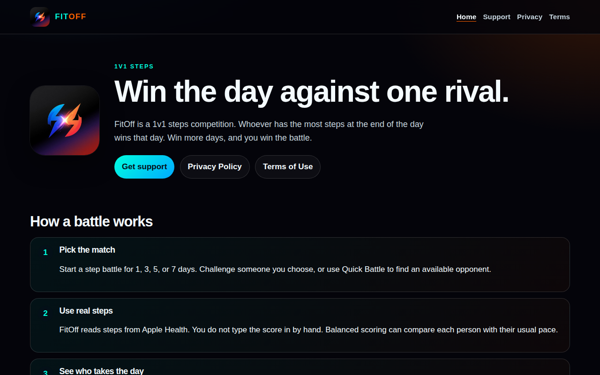
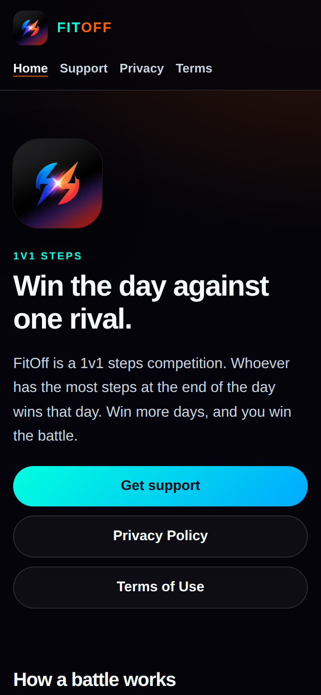
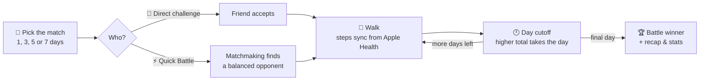

<div align="center">

# ⚡ FitOff

**Win the day against one rival.**

A 1v1 step-battle iOS app. Whoever has the most steps at the end of the day wins that day. Win more days, and you win the battle.


</div>

---

## 📱 Screenshots

| Home / Today's Battle | Live Match | Battle Stats | Weekly Ranks |
|:---:|:---:|:---:|:---:|
| _screenshot coming soon_ | _screenshot coming soon_ | _screenshot coming soon_ | _screenshot coming soon_ |

<!-- Replace the placeholders above with images, e.g.  -->

### Marketing site

The repo also includes the FitOff landing, support, privacy and terms site (`FitOff-website-upload/`), built as static HTML/CSS for Cloudflare Pages.

<p align="center">
  
  &nbsp;
  
</p>

---

## 🥊 How a battle works



## ✨ Features

- **1v1 step battles.** Pick a length (1, 3, 5 or 7 days) and challenge a friend, or use **Quick Battle** to get matched automatically.
- **Real steps only.** Scores come straight from **Apple Health (HealthKit)**, so nobody types in their own numbers.
- **Balanced scoring.** Each player can optionally be compared against their own usual pace, so casual walkers can compete with marathoners.
- **Live Activities and Dynamic Island.** Follow the score on the Lock Screen without opening the app.
- **Battle Stats.** See today's steps, an activity calendar, win rate, streaks, personal records, rivals and match history.
- **Weekly ranks.** Compete on a Global leaderboard or one limited to Friends.
- **Friends and messaging.** Add friends, send direct challenges and chat.
- **Smart notifications.** Morning and evening check-ins, reminders, results and daily recaps, delivered by APNs.
- **FitOff Pro.** A StoreKit 2 auto-renewing subscription that unlocks unlimited simultaneous battles.
- **Privacy first.** Account deletion runs inside the app, plus message-safety tooling.

---

## 🏗️ Architecture

```mermaid
flowchart TB
    subgraph iOS["📱 iOS App · SwiftUI · MVVM"]
        V["Views<br/>Home · Match · Stats · Ranks · Messages"]
        VM["ViewModels"]
        S["Services<br/>HealthKit · Matchmaking · Sync · Subscriptions"]
        W["🔔 Widget Extension<br/>Live Activity"]
        V --> VM --> S
    end

    HK[("❤️ Apple Health")] --> S
    SK["💳 StoreKit 2"] <--> S

    subgraph SB["☁️ Supabase"]
        DB[("🐘 Postgres<br/>RLS · RPCs")]
        EF["⚙️ Edge Functions (Deno/TS)"]
        CRON["⏰ pg_cron"]
        AUTH["🔐 Auth<br/>Email · Sign in with Apple"]
    end

    S <--> AUTH
    S <-->|"step ticks · matches · friends"| DB
    CRON -->|"schedules"| EF
    EF <--> DB
    EF -->|"push"| APNS["🍎 APNs"]
    APNS --> iOS
    APNS --> W
```



### Edge Functions

| Function | Purpose |
|---|---|
| `matchmaking-pairing` / `retry-matchmaking-search` | Pairs Quick Battle players with balanced opponents and retries stale searches |
| `on-all-accepted` | Starts a battle once both players accept |
| `finalize-match-day` / `complete-match` | Settles each day at cutoff and declares the battle winner |
| `update-leaderboard` | Rebuilds the weekly Global and Friends leaderboards |
| `send-morning-checkins` / `send-evening-checkins` / `send-pending-reminders` / `send-daily-recap` | Scheduled engagement notifications |
| `dispatch-notification` | Central APNs push dispatcher |
| `delete-account` | Deletes a user's account and data on request |

`pg_cron` runs these on a schedule. Examples: day-cutoff checks every hour, a matchmaking retry every 5 minutes, and daily check-ins.

---

## 🧰 Tech Stack

| Layer | Tech |
|---|---|
| App | Swift, SwiftUI, MVVM, HealthKit, ActivityKit/WidgetKit, StoreKit 2, UserNotifications |
| Backend | Supabase (Postgres, Row Level Security, RPCs, Auth), Edge Functions in TypeScript/Deno |
| Jobs | `pg_cron` |
| Push | Apple Push Notification service |
| Web | Static HTML/CSS on Cloudflare Pages |

## 📂 Repo Layout

```
FitUp/                     Xcode project (app + widget extension + tests)
  FitUp/FitUp/
    Views/  ViewModels/  Services/  Models/  Repositories/  Design/
supabase/
  functions/               Edge Functions (source of truth)
  migrations/              Schema history
  manual_sql/              SQL Editor scripts & verification queries
  cron.sql                 pg_cron schedules
FitOff-website-upload/     Marketing, support, privacy & terms site
docs/                      TestFlight, privacy & notification docs
scripts/                   Matchmaking test scripts
```

---

<div align="center">

Built by **[Scott Oliver](https://github.com/scootero)**

</div>
