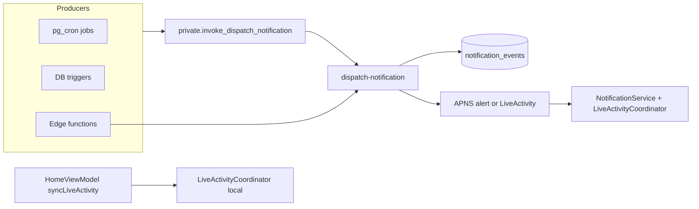
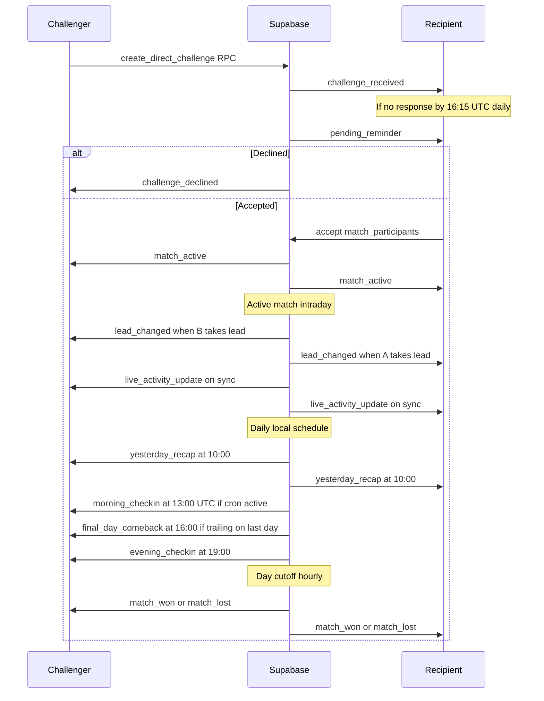
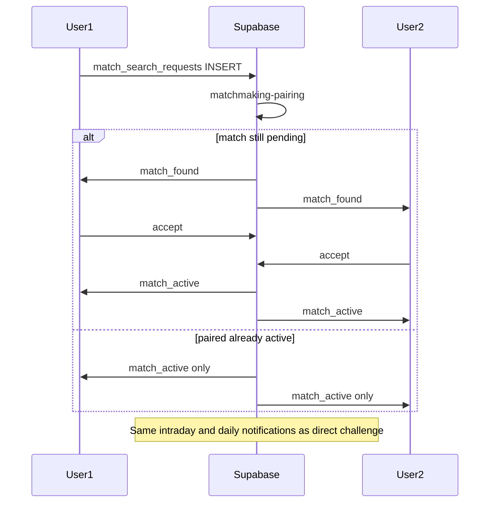

# FitUp Notification System Audit

**Single source of truth** for every notification that can be sent in production.

- **Project:** FitUp-dev (`uushejbizmlxzxonkuki`)
- **Audit date:** 2026-06-01
- **Method:** Read-only codebase inspection + Supabase MCP (`execute_sql`, `list_edge_functions`)
- **Scope:** iOS client, Supabase edge functions, DB triggers, pg_cron, `notification_events`

---

## Architecture

All alert pushes flow through one pipeline:

**Key files:**

| Layer | Path |
|-------|------|
| Central dispatcher | `supabase/functions/dispatch-notification/index.ts` |
| APNs payload | `supabase/functions/_shared/apns.ts` |
| iOS routing | `FitUp/FitUp/FitUp/Services/NotificationService.swift` |
| Deep link consumption | `FitUp/FitUp/FitUp/ContentView.swift` |
| Live Activity (local) | `FitUp/FitUp/FitUp/Views/LiveActivity/LiveActivityCoordinator.swift` |
| User preference | `profiles.notifications_enabled` (server) + Profile toggle (iOS) |

**Delivery model on iOS:** Remote APNs only — no local `UNNotificationRequest` scheduling. In-app inbox is a UserDefaults mirror of received pushes (max 50 items), not a separate enqueue channel.

---

## Global dispatch rules

From `dispatch-notification/index.ts`:

| Rule | Value | Applies to |
|------|-------|------------|
| Daily alert cap | 12 sent/user/local timezone day | All alert types except exempt |
| Cap-exempt | `live_activity_update`, `yesterday_recap`, `friend_request_received`, `friend_request_accepted`, `message_received` | Skip cap |
| `notifications_disabled` | `profiles.notifications_enabled = false` | All types → `failed` |
| Missing token | `missing_apns_token` / `missing_live_activity_token` | Alert / Live Activity |
| APNS not configured | `apns_not_configured` | Alerts |

**`lead_changed` gate** (`evaluateLeadChangeGate`):

| Rule | Value | Failure reason |
|------|-------|----------------|
| Max per local day | 3 | `lead_throttled_daily_cap` |
| Global cooldown | 3 hours | `lead_throttled_cooldown` |
| Per-match cooldown | 6 hours | `lead_throttled_match_cooldown` |
| Min swing (Balanced BS) | 30 Battle Score | `lead_throttled_min_swing` |
| Min swing (raw) | max(500, 1% of leader total) | `lead_throttled_min_swing` |

---

## A. Notification Matrix

Every notification type in the system, with iOS handling.

| Notification Type | Trigger Source | Trigger Conditions | Delivery Method | Deep Link | iOS Inbox Icon | Foreground Celebration |
|------------------|----------------|-------------------|-----------------|-----------|----------------|------------------------|
| `challenge_received` | DB trigger `notify_challenge_received` on `direct_challenges` INSERT | New challenge for recipient; dedup `notification_sent_today` (UTC day + match_id) | APNs alert | `home` → Home + inbox | bolt | Match-found celebration |
| `challenge_declined` | DB trigger `notify_challenge_declined` on `direct_challenges` status→declined; OR `notify_public_matchmaking_declined` on `matches` pending→cancelled (public_matchmaking) | Decline/cancel with opponent identified | APNs alert | `home` | bell (default) | — |
| `match_found` | Edge `matchmaking-pairing` via `_shared/matchmakingPairing.ts` | Public matchmaking pair; match still `pending` | APNs alert | `home` | bolt | Match-found celebration |
| `match_active` | Edge `on-all-accepted` OR matchmaking when already active | All participants accepted / `activate_match_with_days` succeeds | APNs alert | `match_details` → MatchDetails | bolt | Match-active celebration |
| `pending_reminder` | Cron → `send-pending-reminders` | Match `pending`, one party accepted; dedup UTC day + match_id | APNs alert | `match_details` | bell (default) | — |
| `lead_changed` | DB trigger `notify_lead_changed` on `match_day_participants.metric_total` UPDATE | Active match, leader changed; notify trailing user; dispatch throttles | APNs alert | `match_details` | bell (default) | — |
| `live_activity_update` | DB trigger `push_live_activity_updates` on MDP metric change | Active match; requires `live_activity_push_token` | APNs Live Activity (cap-exempt, not alert) | N/A | N/A (not inbox) | — |
| `morning_checkin` | Cron → `send-morning-checkins` | All active matches/participants; dedup UTC day + match_id | APNs alert | `match_details` | bell (default) | — |
| `evening_checkin` | Cron → `send-evening-checkins` | RPC `evening_checkin_candidates`: local hour 19, no daily activity; dedup `local_date` | APNs alert | `match_details` or `home` if no active match | bell (default) | — |
| `yesterday_recap` | Cron → `send-daily-recap` | Local hour 10; ≥1 recap card; dedup `recap_date` | APNs alert (cap-exempt) | `recap_inbox` → Home inbox + recap cards | sportscourt | Parses `recap_cards` on foreground |
| `final_day_comeback` | Cron → `send-daily-recap` | Local hour 16; final competition day, trailing by min gap; dedup match+date | APNs alert | `match_details` | sportscourt | — |
| `match_won` | Edge `complete-match` | Match completed with series winner (ties → no notify) | APNs alert | `match_details` | bell (default) | — |
| `match_lost` | Edge `complete-match` | Match completed; user lost series | APNs alert | `match_details` | bell (default) | — |
| `day_won` | **No active producer** (dispatcher template only) | Removed at finalize per Notifications v1; legacy prod rows May 7–8 | Would be APNs alert | `match_details` (generic iOS fallback) | bell (default) | — |
| `day_lost` | **No active producer** | Same as `day_won` | Would be APNs alert | `match_details` | bell (default) | — |
| `day_void` | **No active producer** | Never seen in prod | Would be APNs alert | `match_details` | bell (default) | — |
| `friend_request_received` | Migration `20260425200000_friendship_notification_triggers.sql` | `friendships` INSERT with `status = pending` | APNs alert (cap-exempt) | `friends` → Profile + friends sheet | person.2 | Friend request banner |
| `friend_request_accepted` | Same migration | pending → accepted | APNs alert (cap-exempt) | `home` + inbox | person.2 | Friend accepted banner |
| `message_received` | Manual SQL `messaging_notify_on_message_insert.sql` | `messages` INSERT; recipient ≠ sender | APNs alert (cap-exempt) | `messages` → Messages sheet | bubble | — |
| `general` | iOS fallback only | Missing `event_type` in payload | In-app inbox label only | Per `deep_link_target` | bell (default) | — |

**iOS special routing** (overrides `deep_link_target` when set):

- `friend_request_received` → `.friends`
- `friend_request_accepted` → `.home` + inbox
- `message_received` → `.messages(peerId:)`

**Unused iOS deep link:** `activity` — handler exists in `NotificationService.routeNotification` but no backend producer sets `deep_link_target: "activity"`.

---

## B. Trigger Matrix

What creates each notification.

| event_type | Producer | Invocation path | Conditions | Dedup / suppression |
|------------|----------|-----------------|------------|----------------------|
| `challenge_received` | `notify_challenge_received()` | `private.invoke_dispatch_notification` | `direct_challenges` INSERT | `notification_sent_today(user, type, match_id)` UTC day |
| `challenge_declined` | `notify_challenge_declined()` | invoke_dispatch | status → declined | Per trigger logic |
| `challenge_declined` | `notify_public_matchmaking_declined()` | invoke_dispatch | pending→cancelled, public_matchmaking | Uses `app.decline_user_id` |
| `match_found` | `matchmakingPairing.ts` | invokeEdgeFunctionAsync → dispatch | Pair succeeds, match `pending`, exactly 2 participants | None |
| `match_active` | `matchmakingPairing.ts` | same | Pair succeeds, match already `active` | None |
| `match_active` | `on-all-accepted/index.ts` | invokeEdgeFunctionAsync → dispatch | `activate_match_with_days` returns true | None |
| `pending_reminder` | `send-pending-reminders` | cron → edge → dispatch | Match pending, one accepted, one not | `alreadySentToday` UTC day + match_id; **no status filter** |
| `morning_checkin` | `send-morning-checkins` | cron → edge → dispatch | Active match participants | `alreadySentToday` UTC day + match_id; **no status filter** |
| `evening_checkin` | `send-evening-checkins` | cron → edge → dispatch | `evening_checkin_candidates()` local hour 19 | `alreadySentThisLocalDate`; **no status filter** |
| `yesterday_recap` | `send-daily-recap` | cron → edge → dispatch | Local hour 10, ≥1 recap card | `alreadySentForLocalDate(recap_date)` |
| `final_day_comeback` | `send-daily-recap` | cron → edge → dispatch | Local hour 16, trailing on final day, min gap | `alreadySentComeback(match_id, local_date)` |
| `lead_changed` | `notify_lead_changed()` | invoke_dispatch | MDP metric_total change, leader swap, active day | Dispatch gate only (not at trigger) |
| `live_activity_update` | `push_live_activity_updates()` | invoke_dispatch | MDP metric_total INSERT/UPDATE | **None** — fires every tick |
| `match_won` / `match_lost` | `complete-match/index.ts` | finalize chain or reconcile cron → edge → dispatch | Series winner determined; ties skip | Idempotent `complete-match` helps |
| `friend_request_*` | Friendship triggers (migration) | invoke_dispatch | Insert pending / accept | Cap-exempt; no dedup |
| `message_received` | `notify_message_insert()` (manual SQL) | invoke_dispatch | Message to recipient | Cap-exempt; no per-message dedup |

**Indirect producers (no direct notification enqueue):**

| Function / job | Chain |
|----------------|-------|
| `finalize-match-day` | Finalizes day → `update-leaderboard` + async `complete-match` |
| `day-cutoff-check` cron | Hourly → finalize chain |
| `reconcile-stuck-match-completions` cron | Every 10 min → `complete-match` |
| `matchmaking-retry-stale` cron | Every 5 min → `matchmaking-pairing` |

**Edge functions with no notification output:** `update-leaderboard`, `retry-matchmaking-search` (indirect only).

---

## C. Schedule Matrix

When notifications can fire.

| Notification | Schedule | Timezone | Notes |
|--------------|----------|----------|-------|
| `morning_checkin` | Cron `0 13 * * *` | **Fixed UTC** (13:00 UTC daily) | Not per-user local; overlaps recap intent |
| `pending_reminder` | Cron `15 16 * * *` | **Fixed UTC** (~16:15 UTC) | Not per-user local |
| `evening_checkin` | Cron `0 * * * *` + RPC filter | **User local 19:00** | Hourly cron; `evening_checkin_candidates()` gates |
| `yesterday_recap` | Cron `0 * * * *` + in-function filter | **User local 10:00** | `RECAP_LOCAL_HOUR = 10` in `send-daily-recap` |
| `final_day_comeback` | Cron `0 * * * *` + in-function filter | **User local 16:00** | `COMEBACK_LOCAL_HOUR = 16` |
| `lead_changed` | Real-time | User local (cap/throttle bounds) | On every qualifying MDP `metric_total` change |
| `live_activity_update` | Real-time | N/A | On every MDP `metric_total` change |
| `match_won` / `match_lost` | Async after finalize | N/A | Triggered by day cutoff / reconcile |
| Match lifecycle (challenge, accept, decline) | Event-driven | N/A | DB triggers / edge on state change |
| `message_received` | Event-driven | N/A | On message INSERT |

### Active pg_cron jobs (prod, 2026-06-01)

| Job Name | Schedule | Function Called | Notifications Produced |
|----------|----------|-----------------|------------------------|
| `day-cutoff-check` | `5 * * * *` | `public.day_cutoff_check()` | Indirect → `match_won` / `match_lost` |
| `send-pending-reminders` | `15 16 * * *` | `send-pending-reminders` | `pending_reminder` |
| `send-morning-checkins` | `0 13 * * *` | `send-morning-checkins` | `morning_checkin` |
| `send-evening-checkins` | `0 * * * *` | `send-evening-checkins` | `evening_checkin` |
| `send-daily-recap` | `0 * * * *` | `send-daily-recap` | `yesterday_recap`, `final_day_comeback` |
| `reconcile-stuck-match-completions` | `*/10 * * * *` | `reconcile_stuck_match_completions()` | Indirect → `match_won` / `match_lost` |
| `matchmaking-retry-stale` | `*/5 * * * *` | `matchmaking_retry_stale_searches(5,30)` | Indirect → `match_found` / `match_active` |

**Note:** `notifications_v1_05_pause_legacy_crons.sql` (unschedule morning check-in) has **not** been run — morning cron is still active.

---

## D. Dead Code Report

| Item | Code location | Prod evidence | Status |
|------|---------------|---------------|--------|
| `day_won` / `day_lost` / `day_void` | Templates in `dispatch-notification/index.ts` only | 10 `day_won`, 10 `day_lost` rows (May 7–8 only); 0 `day_void` | **Removed from producers** (v1); templates remain |
| `deep_link_target: activity` | iOS `NotificationService.routeNotification` | Never enqueued | **Dead iOS handler** |
| `event_type: general` | iOS inbox fallback | N/A | **Client-only fallback** |
| `friend_request_received` / `friend_request_accepted` | Migration + iOS handlers ready | 0 rows; **0 friendship triggers in prod** | **Not reachable in prod** until migration applied |
| `match_found` | `matchmakingPairing.ts` | 0 rows all-time | **Code-valid, untested in prod data** |
| `morning_checkin` | Active cron + edge function | 12 rows; v1 doc says disable after recap verified | **Scheduled legacy overlap** — disable via v1_05 |

---

## E. Duplicate / Overlap Risk Report

| Risk | Severity | Detail |
|------|----------|--------|
| `morning_checkin` + `yesterday_recap` | **High** | Both are morning nudges; v1 replaces day results with recap at local 10:00. Morning cron still active (`notifications_v1_05` not run). |
| `live_activity_update` volume + failures | **High** | 3,274 all-time events; ~88% failed. No dedup; fires on every metric tick. Failures: `apns_live_activity_410` (1,697), `missing_live_activity_token` (321). |
| Dedup ignores failed status | **Medium** | Failed `notification_events` rows still block same-day resend for pending/morning/evening dedup queries. |
| `lead_changed` + `live_activity_update` | **Medium** | Same MDP update can fire both; different channels (alert vs Live Activity). |
| `match_found` + `match_active` | Low (intentional) | Two-step accept for public matchmaking. |
| `final_day_comeback` + `evening_checkin` | Low | Same final day: 16:00 vs 19:00 local. |
| `pending_reminder` + `challenge_received` | Low | Different lifecycle stages. |
| Daily cap blocking batch finalize | **Medium** | Legacy `day_won`/`day_lost` failures show `daily_cap_reached` (9+6 failures); cap can suppress completion notifications on heavy days. |
| Stale APNs tokens (410) | **Medium** | `evening_checkin`: 9× `apns_alert_410`; `live_activity_update`: 1,697× `apns_live_activity_410`. Tokens not cleared on 410. |

---

## F. TestFlight Recommendations

| Type | Recommendation | Rationale |
|------|----------------|-----------|
| `yesterday_recap` | **Keep** | v1 primary day-result channel; 4 sent, active Jun 1 |
| `final_day_comeback` | **Keep** | 1 sent Jun 1; high value, low volume |
| `evening_checkin` | **Keep** | Active, timezone-aware; 25 sent (30d) |
| `lead_changed` | **Keep** | Throttled; prod shows caps working (`lead_throttled_match_cooldown` observed) |
| `match_won` / `match_lost` | **Keep** | Series completion; recent May 29 |
| `match_active` | **Keep** | Battle start; 4 sent, active Jun 1 |
| `challenge_received` / `challenge_declined` | **Keep** | Core direct challenge UX |
| `pending_reminder` | **Keep** | Useful for stalled accepts |
| `message_received` | **Keep** | Trigger deployed; 4 sent |
| `morning_checkin` | **Disable** | Run `notifications_v1_05_pause_legacy_crons.sql` after recap TestFlight pass |
| `day_won` / `day_lost` / `day_void` | **Remove** (templates) | Producers removed; clean dispatcher templates post-TestFlight |
| `live_activity_update` | **Keep**, fix token hygiene | High fail rate; clear stale tokens on 410; consider dedup/throttle post-TestFlight |
| `match_found` | **Keep**, add TestFlight test | Required for quick battle; 0 prod rows — needs explicit QA |
| `friend_request_*` | **Postpone** | Apply friendship migration before enabling |
| `matchmaking-retry-stale` cron | **Keep** | Indirect enabler for quick battle notifications |

### APNs / TestFlight pairing

From [testflight-push-verification.md](testflight-push-verification.md):

| Check | Guidance |
|-------|----------|
| IPA `aps-environment` | TestFlight IPAs typically embed `production` — verify with `codesign -d --entitlements` on the IPA, not the repo entitlements file |
| `APNS_USE_SANDBOX` | Must match IPA: `production` → `false`; `development` → `true` |
| Alert token | `profiles.apns_token` — 8/8 profiles have tokens in FitUp-dev |
| Live Activity token | `profiles.live_activity_push_token` — separate from alert token; 4/8 profiles; widget extension `com.ScottOliver.FitUp.FitUpWidgetExtension` required |
| User toggle | `profiles.notifications_enabled` — 0 disabled in dev |
| Test flows | Direct challenge → `challenge_received`; matchmaking → `match_found` (when paired pending); tap → verify deep links in `NotificationService` |
| Failure triage | Check `notification_events.payload.failure_reason` and Edge Function logs for `dispatch-notification` |

---

## Phase 3 — Runtime validation (FitUp-dev prod DB)

**Captured:** 2026-06-01 via MCP `execute_sql`.

### Profile / token readiness

| Metric | Value |
|--------|------:|
| Total profiles | 8 |
| With APNs token | 8 |
| With Live Activity token | 4 |
| Notifications disabled | 0 |

### All-time `notification_events` by type

| event_type | count | first_seen (UTC) | last_seen (UTC) |
|------------|------:|------------------|-----------------|
| `live_activity_update` | 3,274 | 2026-04-23 | 2026-06-01 |
| `lead_changed` | 40 | 2026-04-24 | 2026-05-24 |
| `evening_checkin` | 34 | 2026-05-08 | 2026-06-01 |
| `challenge_received` | 25 | 2026-04-23 | 2026-05-24 |
| `morning_checkin` | 12 | 2026-05-07 | 2026-06-01 |
| `day_won` | 10 | 2026-05-07 | 2026-05-08 |
| `day_lost` | 10 | 2026-05-07 | 2026-05-08 |
| `match_lost` | 6 | 2026-05-07 | 2026-05-29 |
| `match_won` | 6 | 2026-05-07 | 2026-05-29 |
| `pending_reminder` | 5 | 2026-05-07 | 2026-05-28 |
| `yesterday_recap` | 4 | 2026-05-29 | 2026-06-01 |
| `challenge_declined` | 4 | 2026-05-01 | 2026-05-10 |
| `message_received` | 4 | 2026-05-23 | 2026-05-24 |
| `match_active` | 4 | 2026-05-29 | 2026-06-01 |
| `final_day_comeback` | 1 | 2026-06-01 | 2026-06-01 |

### Types defined in code but never seen in prod

| event_type |
|------------|
| `match_found` |
| `day_void` |
| `friend_request_received` |
| `friend_request_accepted` |

### 30-day status breakdown

| event_type | sent | failed |
|------------|-----:|-------:|
| `live_activity_update` | 124 | 902 |
| `evening_checkin` | 25 | 9 |
| `lead_changed` | 12 | 3 |
| `challenge_received` | 11 | 0 |
| `morning_checkin` | 7 | 5 |
| `match_lost` | 5 | 1 |
| `day_lost` | 4 | 6 |
| `match_active` | 4 | 0 |
| `message_received` | 4 | 0 |
| `yesterday_recap` | 4 | 0 |
| `match_won` | 3 | 3 |
| `pending_reminder` | 3 | 2 |
| `day_won` | 1 | 9 |
| `final_day_comeback` | 1 | 0 |
| `challenge_declined` | 1 | 0 |

### Failure reasons (all-time)

| event_type | failure_reason | count |
|------------|----------------|------:|
| `live_activity_update` | `apns_live_activity_410` | 1,697 |
| `live_activity_update` | `missing_live_activity_token` | 321 |
| `day_won` | `daily_cap_reached` | 9 |
| `evening_checkin` | `apns_alert_410` | 9 |
| `lead_changed` | `daily_cap_reached` | 7 |
| `challenge_received` | `daily_cap_reached` | 7 |
| `day_lost` | `daily_cap_reached` | 6 |
| `morning_checkin` | `daily_cap_reached` | 5 |
| `match_won` | `daily_cap_reached` | 3 |
| `lead_changed` | `lead_throttled_match_cooldown` | 1 |
| `match_lost` | `daily_cap_reached` | 1 |
| `pending_reminder` | `apns_alert_410` | 1 |
| `pending_reminder` | `daily_cap_reached` | 1 |

### DB triggers deployed vs repo

**Deployed in prod:**

| Trigger | Table |
|---------|-------|
| `tr_notify_challenge_received` | `direct_challenges` |
| `tr_notify_challenge_declined` | `direct_challenges` |
| `tr_notify_public_matchmaking_declined` | `matches` |
| `tr_notify_lead_changed` | `match_day_participants` |
| `tr_push_live_activity_updates` | `match_day_participants` |
| `tr_on_all_accepted_after_participant` | `match_participants` |
| `tr_notify_message_insert` | `messages` |

**In repo but NOT deployed:** `tr_notify_friend_request_insert`, `tr_notify_friend_request_accepted` on `friendships` (migration `20260425200000_friendship_notification_triggers.sql`).

**Manual SQL deployed:** `notify_lead_changed` includes `scoring_mode` in payload (`lead_fn_has_scoring_mode = true`).

### Deployed edge functions vs repo

All 11 repo functions are deployed and ACTIVE:

| Slug | Version | Notification role |
|------|--------:|-------------------|
| `dispatch-notification` | 8 | Central hub |
| `send-daily-recap` | 2 | `yesterday_recap`, `final_day_comeback` |
| `send-evening-checkins` | 3 | `evening_checkin` |
| `send-morning-checkins` | 3 | `morning_checkin` |
| `send-pending-reminders` | 2 | `pending_reminder` |
| `complete-match` | 7 | `match_won`, `match_lost` |
| `finalize-match-day` | 10 | Indirect (no day pushes) |
| `on-all-accepted` | 2 | `match_active` |
| `matchmaking-pairing` | 6 | `match_found`, `match_active` |
| `retry-matchmaking-search` | 3 | Indirect |
| `update-leaderboard` | 3 | None |

---

## Phase 4 — User Experience Timelines

### Direct Challenge Flow

**No push on individual day win/loss** — outcomes appear in `yesterday_recap` at local 10:00.

### Quick Battle (Public Matchmaking) Flow

**Prod gap:** `match_found` has 0 `notification_events` rows — no pending public-matchmaking pairs observed in FitUp-dev.

---

## Appendix: iOS infrastructure summary

| Concern | Implementation |
|---------|----------------|
| Permission | `NotificationService.requestAuthorization()` → alert, badge, sound |
| Token registration | `AppDelegate` → `NotificationService.didRegister` → `ProfileRepository.updatePushTokens` |
| Live Activity token | `LiveActivityCoordinator` → `storeLiveActivityToken` → `live_activity_push_token` |
| Foreground presentation | Banner + sound + badge for all alert types |
| Cold start from push | No `launchOptions` remote-notification handler in AppDelegate; routing via tap delegate |
| Preferences | Profile toggle → `notifications_enabled` on profile |
| Local Live Activity | `HomeViewModel.syncLiveActivity()` starts/updates when active match on Home |

---

## Related docs

- [notifications-v1-implementation.md](../FitUp/docs/notifications-v1-implementation.md) — v1 behavior and deploy order
- [testflight-push-verification.md](testflight-push-verification.md) — TestFlight APNs verification checklist
- [notifications_v1_00_readonly_checks.sql](../supabase/manual_sql/notifications_v1_00_readonly_checks.sql) — repeatable readonly SQL checks
